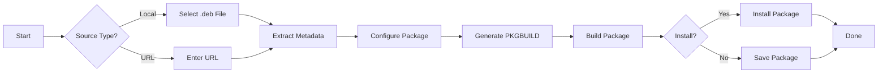

<div align="center">

# 🔄 deb2arch


### 🚀 Interactive .deb to Arch Package Converter

*Convert Debian packages to Arch Linux packages with ease*

**Engineered by [oxbv1 | 0xb0rn3](https://github.com/0xb0rn3)**

[Features](#-features) • [Installation](#-installation) • [Usage](#-usage) • [Examples](#-examples) • [Contributing](#-contributing)

</div>

---

## 🎯 Overview

**deb2arch** is a powerful, interactive command-line tool that simplifies the conversion of Debian (.deb) packages into Arch Linux packages (.pkg.tar.zst). Say goodbye to manual PKGBUILD creation and dependency hunting!

```
┌─────────────────────────────────────────┐
│  .deb Package  →  deb2arch  →  .pkg.tar.zst │
└─────────────────────────────────────────┘
```

## ✨ Features

<table>
<tr>
<td width="50%">

### 🎨 **Interactive Interface**
- Beautiful terminal UI with prompts
- Auto-detection of package metadata
- Smart defaults for quick conversions

### 📦 **Flexible Input**
- Local .deb files
- Remote URLs
- Auto-downloads and processes

</td>
<td width="50%">

### 🔧 **Smart Processing**
- Extracts package information automatically
- Handles all compression formats (xz, gz, zst)
- Generates proper PKGBUILD files

### ⚡ **Convenient Output**
- Custom save directories
- Optional auto-install
- Permission fixes included

</td>
</tr>
</table>

## 📋 Requirements

```bash
# Required packages
- ar (binutils)
- bsdtar (libarchive)
- makepkg (pacman)
```

These are typically pre-installed on Arch Linux systems.

## 🔧 Installation

### Quick Install

```bash
# Clone the repository
git clone https://github.com/0xb0rn3/deb2arch.git

# Navigate to directory
cd deb2arch

# Make executable
chmod +x run

# Run the tool
./run
```

### Install Globally (Optional)

```bash
# Copy to /usr/local/bin
sudo cp run /usr/local/bin/deb2arch

# Now run from anywhere
deb2arch
```

## 🚀 Usage

Simply execute the tool and follow the interactive prompts:

```bash
./run
```

### Workflow

<div align="center">



</div>

### Step-by-Step

1️⃣ **Choose Source Type**
   - Option 1: Local .deb file
   - Option 2: Remote URL

2️⃣ **Provide Package Information**
   - Package name (auto-detected)
   - Version (auto-detected)
   - Architecture
   - Description
   - Dependencies

3️⃣ **Configure Build**
   - Build directory
   - Save location
   - Install option

4️⃣ **Build & Install**
   - Automatic PKGBUILD generation
   - Package building with makepkg
   - Optional installation

## 💡 Examples

### Example 1: Converting a Local .deb

```bash
$ ./run

╔════════════════════════════════════════════════╗
║      deb2arch - .deb to Arch Converter        ║
║      Engineered by: oxbv1 | 0xb0rn3           ║
╚════════════════════════════════════════════════╝

📦 Package Source
1) Local .deb file
2) URL to .deb file
Select option [1-2]: 1
Enter path to .deb file: /home/user/downloads/package.deb

🔍 Extracting package information...

📝 Package Information
Package name [package]: myapp
Version [1.2.3]: 
Release [1]: 
...
```

### Example 2: Converting from URL

```bash
$ ./run

📦 Package Source
Select option [1-2]: 2
Enter URL to .deb file: https://example.com/package_1.0.0.deb

📝 Package Information
Package name [package]: 
Version [1.0.0]: 
...
```

### Example 3: Quick Conversion with Auto-Install

```bash
$ ./run
# Select local file
# Accept all defaults by pressing Enter
# Choose 'y' for install when prompted
# Done! Package installed automatically
```

## 📁 Output Structure

```
build-directory/
├── PKGBUILD              # Generated build script
├── src/                  # Extracted source files
└── package-1.0.0-1-x86_64.pkg.tar.zst  # Built package
```

## 🎯 Use Cases

- 🔒 **Pentesting Tools**: Convert security tools packaged as .deb
- 💼 **Proprietary Software**: Package commercial software for Arch
- 🧪 **Testing**: Try Debian packages on Arch Linux
- 📦 **Package Maintenance**: Create Arch packages from upstream .deb releases

## 🛠️ Advanced Usage

### Custom Dependencies

When prompted for dependencies, enter them as comma-separated values:

```
Dependencies: lib1, lib2, python-package
```

### Specifying Architecture

Common architectures:
- `x86_64` - 64-bit Intel/AMD
- `aarch64` - 64-bit ARM
- `any` - Architecture-independent

### Build Directory Options

Use custom paths for organization:
```
Build directory: ~/builds/mypackage
Save package to: ~/packages/
```

## 🐛 Troubleshooting

### Common Issues

**Issue**: `ar: command not found`
```bash
sudo pacman -S binutils
```

**Issue**: `bsdtar: command not found`
```bash
sudo pacman -S libarchive
```

**Issue**: Dependencies not working
- Manually edit the generated PKGBUILD
- Check Arch package names (often different from Debian)
- Use `pacman -Ss` to find correct package names

### Getting Help

```bash
# Check tool version
./run --version

# Report issues
# Visit: https://github.com/0xb0rn3/deb2arch/issues
```

## 🤝 Contributing

Contributions are welcome! Here's how you can help:

1. 🍴 Fork the repository
2. 🌿 Create a feature branch (`git checkout -b feature/amazing-feature`)
3. 💾 Commit your changes (`git commit -m 'Add amazing feature'`)
4. 📤 Push to the branch (`git push origin feature/amazing-feature`)
5. 🎉 Open a Pull Request

### Development

```bash
# Clone your fork
git clone https://github.com/yourusername/deb2arch.git

# Create a branch
git checkout -b feature/your-feature

# Make changes and test
./run

# Submit PR
```

## 📝 License

This project is licensed under the MIT License - see the [LICENSE](LICENSE) file for details.

## 🙏 Acknowledgments

- Inspired by the need for easier .deb conversion on Arch Linux
- Built for the Arch Linux community
- Special thanks to all contributors

## 📬 Contact

**oxbv1 | 0xb0rn3**

- GitHub: [@0xb0rn3](https://github.com/0xb0rn3)
- Project: [deb2arch](https://github.com/0xb0rn3/deb2arch)

---

<div align="center">

### ⭐ Star this repository if you find it helpful!

**Made with ❤️ for the Arch Linux community**

```
 ██████╗ ██╗  ██╗██████╗  ██████╗ ██████╗ ███╗   ██╗███████╗
██╔═████╗╚██╗██╔╝██╔══██╗██╔═████╗██╔══██╗████╗  ██║██╔════╝
██║██╔██║ ╚███╔╝ ██████╔╝██║██╔██║██████╔╝██╔██╗ ██║█████╗  
████╔╝██║ ██╔██╗ ██╔══██╗████╔╝██║██╔══██╗██║╚██╗██║██╔══╝  
╚██████╔╝██╔╝ ██╗██████╔╝╚██████╔╝██║  ██║██║ ╚████║███████╗
 ╚═════╝ ╚═╝  ╚═╝╚═════╝  ╚═════╝ ╚═╝  ╚═╝╚═╝  ╚═══╝╚══════╝
```

[⬆ Back to Top](#-deb2arch)

</div>
